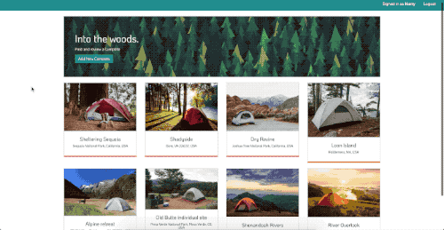

# Bivouak
Find and review camp sites. Add a new site with the name, price, location, and description of the site. Check out the posted sites and leave a comment.

View the deployed site: [bivouak.herokuapp.com](https://bivouak.herokuapp.com/) 

## Features
* Pagination
* Maps Geocoding
* Authentication/Authorization
* Dynamic display messages

## Built With
* EJS (Templating)
* MongoDB & Mongoose (Database)
* Google Maps/Geocoding API (Maps)
* Passport.js (Auth)
* Moment.js (Timestamp posts)
* Cloudinary (Image hosting)
* Connect-flash (Dynamic messaging)
* Node
* Express
* Javascript
* HTML
* CSS

## License
This project is licensed under the MIT License - see the LICENSE.md file for details.